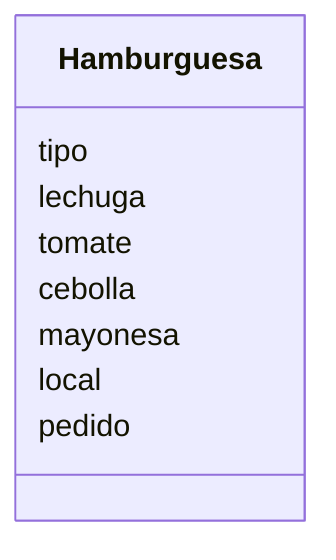

# Escenario
Un restaurante quiere ofrecer hamburguesas
Los clientes pueden elegir entre hamburguesa de: res, pollo
o vegetariana.
Los clientes pueden agregar extras como: lechuga, tomate, 
cebolla y mayonesa
Ademas los clientes pueden decidir comer en el restaurante 
o llevar su pedido

# Análisis

Requisitos:
- Ofrece hamburguesas de res, pollo o vegetariana
- Agregar extra de lechuga, tomate, cebolla y mayonesa
- Los clientes pueden comer en el restaurante
- Los clientes pueden llevar su pedido

Objetos:
- Hamburguesa

Características:
- Hamburguesa
    - tipo
    - lechuga
    - tomate
    - cebolla
    - mayonesa
    - local
    - pedido

Acciones:
- (No hay acciones)

# Diseño:

Clases:
- Hamburguesa 🍔:
    - Nombre: Hamburguesa
    - Atributos:
        - tipo
        - lechuga
        - tomate
        - cebolla
        - mayonesa
        - local
        - pedido
    - Métodos:
        - (No hay métodos)

