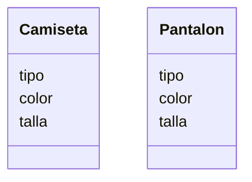

# Escenario
Una tienda de ropa quiere ofrecer camisetas y pantalones
Los clientes pueden elegir entre: camiseta
de manga corta o larga y pantalón de mezclilla o tela
Las camisetas pueden ser de color rojo, azul o verde
y los pantalones de color negro, gris o blanco
Las camisetas tienen las tallas: S, M, L, XL
Los pantalones tienen las tallas desde la 32 hasta la 44

# Análisis

Requisitos:
- Ofrece camisetas de manga corta o larga
- Ofrece pantalones de mezclilla o tela
- Camisetas de color rojo, azul o verde
- Pantalones de color negro, gris o blanco
- Camisetas en tallas S, M, L, XL
- Pantalones desde la talla 32 hasta la 44

Objetos:
- Camiseta
- Pantalón
  
Características:
- Camiseta:
    - tipo
    - color
    - talla
- Pantalón:
    - tipo
    - color
    - talla

Acciones:
- (No hay acciones)
  
# Diseño

Clases:
- Camiseta 👕:
    - Nombre: Camiseta
    - Atributos:
        - tipo
        - color
        - talla
    - Métodos:
      - (No hay métodos)
- Pantalón 👖:
    - Nombre: Pantalón
    - Atributos:
        - tipo
        - color
        - talla
    - Métodos:
      - (No hay métodos)

