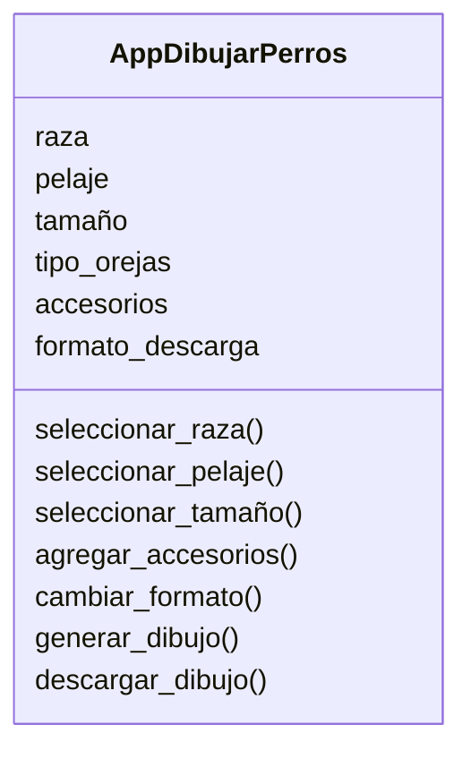

# Escenario
Estas diseñando una app para dibujar perros con IA 
los usuarios pueden seleccionar características como 
la raza (por ejemplo, labrador o pastor alemán), el color 
del pelaje, el tamaño y el tipo de orejas.
Además, pueden agregar hasta dos accesorios, como sombreros 
o gafas.
El dibujo final puede descargarse en formato PNG o JPG.

# Análisis

Requisitos:
- App para dibujar perros con IA
- Seleccionar la raza (labrador, pastor alemán, etc.)
- Seleccionar el pelaje (blanco, marrón, negro, etc.)
- Seleccionar el tamaño (pequeño, mediano, grande)
- Seleccionar el tipo de orejas (caídas, erguidas)
- Agregar hasta dos accesorios (sombreros o gafas)
- Descargar el dibujo en formato PNG o JPG

Objetos:
- App para dibujar perros

Características:
- App para dibujar perros
    - raza
    - pelaje
    - tamaño
    - tipo de orejas
    - accesorios
    - formato de descarga

Acciones:
- seleccionar raza
- seleccionar pelaje
- seleccionar tamaño
- agregar accesorios
- cambiar el formato
- generar dibujo
- descargar dibujo

# Diseño:

Clases:
- App para dibujar perros 🐶:
    - Nombre: App para dibujar perros
    - Atributos:
        - raza
        - pelaje
        - tamaño
        - tipo de orejas
        - accesorios
        - formato de descarga
    - Métodos:
        - seleccionar_raza()
        - seleccionar_pelaje()
        - seleccionar_tamaño()
        - agregar_accesorios()
        - cambiar_formato()
        - generar_dibujo()
        - descargar_dibujo()

