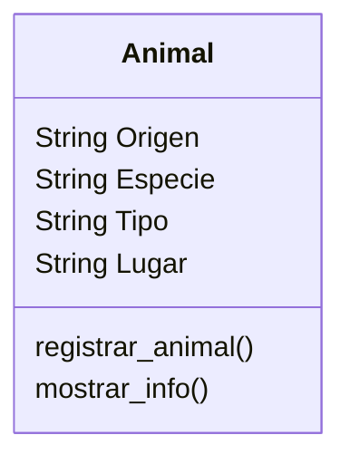

# Escenario
Un zoológico quiere llevar un registro de los animales que llegan 
a sus instalaciones.
Necesitan registrar su especie, tipo y lugar donde los encontraron.
Los animales del zoológico pueden ser mamíferos, reptiles o aves.
El origen de todos los animales es "feral". 
Este zoológico cuenta con 2 mamíferos, 1 reptil y 1 ave

# Análisis

Requisitos:
- Registrar animales
- Registrar la especie (mamífero, reptil, ave)
- Registrar el tipo
- Registrar el lugar donde los encontraron
- Registrar el origen (para todos: "feral")

Objetos:
- Animal

Características:
- Animal
    - Origen
    - Especie
    - Tipo
    - Lugar

Acciones:
- Registrar animal
- Mostrar la información

# Diseño

Clases:
- Animal:
    - Nombre: Animal
    - Atributos:
        - Origen
        - Especie
        - Tipo
        - Lugar
    - Métodos:
        - registrar_animal()
        - mostrar_info()

