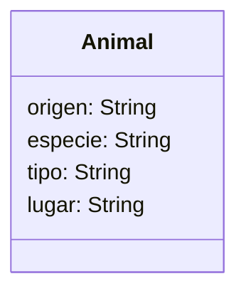

# Escenario
Un zoológico quiere llevar un registro de los animales que llegan 
a sus instalaciones.
Necesitan registrar su especie, tipo y lugar donde los encontraron.
Los animales del zoológico pueden ser mamíferos, reptiles o aves.
El origen de todos los animales es "feral". 
Este zoológico cuenta con 2 mamíferos, 1 reptil y 1 ave

# Análisis

Requisitos:
- Crear un registro de los animales que llegan a un zoológico
- Registrar la especie de los animales (mamífero, reptil, ave)
- Registrar el tipo de los animales
- Registrar el lugar donde encontraron a los animales
- Asignar el origen como "feral" para todos los animales

Objetos:
- Animal

Características:
- Animal
    - origen: String
    - especie: String
    - tipo: String
    - lugar: String

Acciones:
- (No hay acciones)

# Diseño

Clases:
- Animal:
    - Nombre: Animal
    - Atributos:
        - origen
        - especie
        - tipo
        - lugar
    - Métodos:
        - (no hay métodos)

