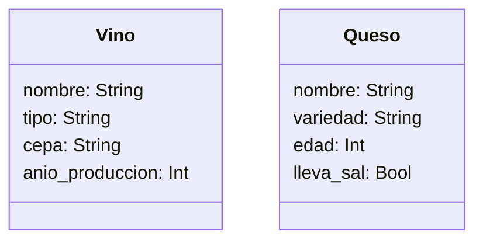

# Escenario
Una vinoteca quiere registrar los vinos y quesos que ofrecen.
De cada vino se necesita registrar su nombre, tipo, cepa y 
año de producción.
De cada queso se necesita registrar su nombre, variedad, 
edad y si lleva sal.
La vinoteca tiene en su inventario 4 vinos y 3 quesos 

# Análisis

Requisitos:
- Crear un registro de vinos y quesos para una vinoteca
- Registrar de cada vino: nombre, tipo, cepa y año de producción 
- Registrar de cada queso: nombre, variedad, edad y si lleva sal 

Objetos:
- Vino
- Queso
  
Características:
- Vino:
    - nombre
    - tipo
    - cepa
    - año de producción
- Queso:
    - nombre
    - variedad
    - edad
    - lleva sal

Acciones:
- (no hay acciones)

# Diseño

Clases:
- Vino:
  - Nombre: Vino
  - Atributos:
      - nombre: String
      - tipo: String
      - cepa: String
      - anio_produccion: Int
  - Métodos:
      - (no hay métodos)

- Queso:
  - Nombre: Queso
  - Atributos:
      - nombre: String
      - variedad: String
      - edad: Int
      - lleva_sal: Bool
  - Métodos:
      - (no hay métodos)
