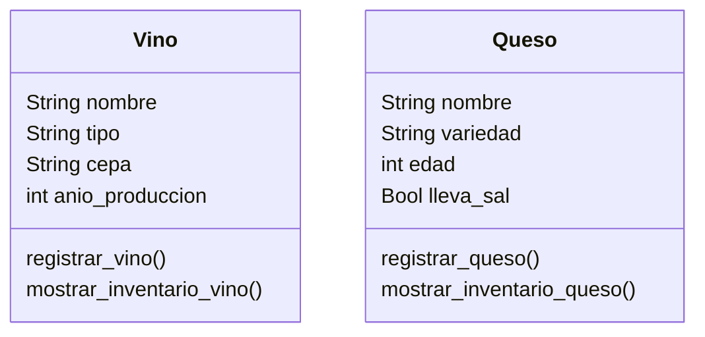

# Escenario
Una vinoteca quiere registrar los vinos y quesos que ofrecen.
De cada vino se necesita registrar su nombre, tipo, cepa y 
año de producción.
De cada queso se necesita registrar su nombre, variedad, 
edad y si lleva sal.
La vinoteca tiene en su inventario 4 vinos y 3 quesos 

# Análisis

Requisitos:
- Registrar vinos y quesos
- Registrar atributos de los vinos (nombre, tipo, cepa y año de producción)
- Registrar atributos de los quesos (nombre, variedad, edad y si lleva sal)

Objetos:
- Vino
- Queso
  
Características:
- Vino:
    - Nombre
    - Tipo
    - Cepa
    - Año de producción
- Queso:
    - Nombre
    - Variedad
    - Edad
    - Lleva sal

Acciones:
- Registrar vinos y quesos
- Mostrar el inventario de vinos y quesos

# Diseño

Clases:
- Vino:
  - Nombre: Vino
  - Atributos:
      - Nombre
      - Tipo
      - Cepa
      - Año produccion
  - Métodos:
      - registrar_vino()
      - mostrar_inventario_vino()

- Queso:
  - Nombre: Queso
  - Atributos:
      - Nombre
      - Variedad
      - Edad
      - Lleva sal
  - Métodos:
      - registrar_queso()
      - mostrar_inventario_queso()
