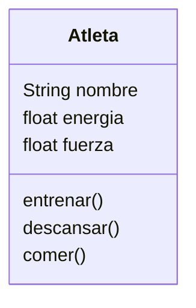

# Escenario
Imagina un juego de rol en el que el personaje principal es un atleta.
Este personaje tiene tres atributos principales:
nombre: identifica al atleta
energía: representa su nivel de energía actual.
fuerza: indica su capacidad física.

Cada atleta puede realizar las siguientes acciones:
Entrenar: aumenta su fuerza, pero consume energía.
Descansar: recupera energía.
Comer: solo puede consumir hamburguesas, lo que también le ayuda a recuperar energía.

# Análisis

Requisitos:
- Crear un atleta
- El atleta tiene tres atributos (nombre, energía y fuerza)
- El atleta puede realizar acciones (entrenar, descansar y comer(solo hamburguesa))

Objetos:
- Atleta

Características:
- Atleta: nombre, energía, fuerza

Acciones:
- Atleta: entrenar, descansar y comer

