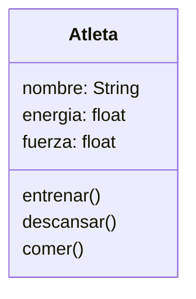

# Escenario
Imagina un juego de rol en el que el personaje principal es un atleta.
Este personaje tiene tres atributos principales:
nombre: identifica al atleta
energía: representa su nivel de energía actual.
fuerza: indica su capacidad física.

Cada atleta puede realizar las siguientes acciones:
Entrenar: aumenta su fuerza, pero consume energía.
Descansar: recupera energía.
Comer: solo puede consumir hamburguesas, lo que también le ayuda a recuperar energía.

# Análisis

Requisitos:
- Crear el personaje atleta que representa al personaje principal del juego
- Asignar tres atributos al atleta: nombre, energía y fuerza
- Implementar las acciones que realiza el atleta: entrenar, descansar y comer
- Recuperar energía solo comiendo hamburguesa
- Aumentar la fuerza del atleta consume energía
- Descansar permite recuperar energía

Objetos:
- Atleta

Características:
- Atleta: 
    - nombre
    - energía
    - fuerza

Acciones:
- Atleta: 
    - entrenar
    - descansar
    - comer

# Diseño

Clases:
- Atleta:
  - Nombre: Atleta
  - Atributos:
      - nombre: String
      - energia: float
      - fuerza: float
  - Métodos:
      - entrenar()
      - descansar()
      - comer()

