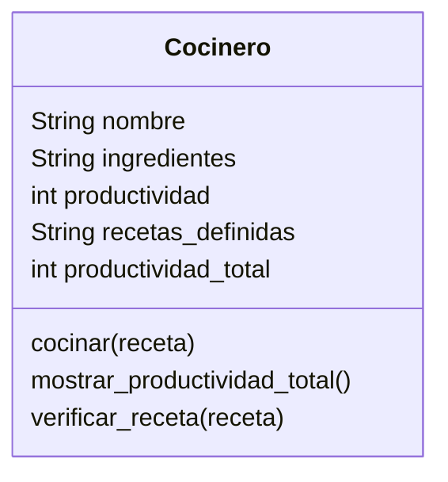

# Escenario
Imagina un sistema que modela el trabajo de cocineros en una cocina profesional.
Cada cocinero tiene tres elementos clave:
Una lista de ingredientes disponibles.
Un conjunto de recetas definidas que puede preparar
Un contador de productividad, que aumenta cada vez que prepara una receta con éxito. Si hay más de un cocinero, sus puntos individuales pueden sumarse para obtener una métrica agregada de productividad.
Únicas recetas permitidas en el sistema: Pan (harina, agua), pizza (harina, agua, sal, tomate, queso), galleta(harina, agua, sal, chocolate)

# Análisis

Requisitos:
- Crear un cocinero
- Los cocineros tienen una lista de ingredientes disponibles
- Los cocineros tienen un conjunto de recetas definidas (Pan, Pizza, Galleta)
- Calcular la métrica agregada de productividad

Objetos:
- Cocinero

Características:
- Cocinero: nombre, ingredientes, productividad, recetas_definidas, productividad_total

Acciones:
- Cocinero: cocinar, mostrar_productividad_total, verificar_receta

