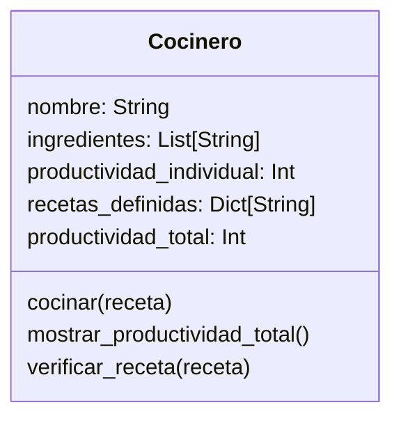

# Escenario
Imagina un sistema que modela el trabajo de cocineros en una cocina profesional.
Cada cocinero tiene tres elementos clave:
Una lista de ingredientes disponibles.
Un conjunto de recetas definidas que puede preparar
Un contador de productividad, que aumenta cada vez que prepara una receta con éxito. Si hay más de un cocinero, sus puntos individuales pueden sumarse para obtener una métrica agregada de productividad.
Únicas recetas permitidas en el sistema: Pan (harina, agua), pizza (harina, agua, sal, tomate, queso), galleta(harina, agua, sal, chocolate)

# Análisis

Requisitos:
- Modelar el trabajo de un cocinero en una cocina profesional
- Registrar los ingredientes disponibles de cada cocinero
- Definir un conjunto limitado de recetas que el cocinero puede preparar: pan, pizza y galleta
- Verificar si un cocinero tiene los ingredientes necesarios para una receta
- Incrementar la productividad del cocinero cuando prepara una receta con éxito
- Calcular la productividad agregada cuando existen varios cocineros

Objetos:
- Cocinero

Características:
- Cocinero:
    - nombre
    - ingredientes
    - productividad_individual
    - recetas_definidas
    - productividad_total

Acciones:
- Cocinero: 
    - cocinar
    - mostrar_productividad_total
    - verificar_receta

# Diseño

Clases:
- Cocinero:
  - Nombre: Cocinero
  - Atributos:
      - nombre: String
      - ingredientes: List[String]
      - productividad_individual: Int
      - recetas_definidas: Dict[String]
      - productividad_total: Int
  - Métodos:
      - cocinar()
      - mostrar_productividad_total()
      - verificar_receta()

