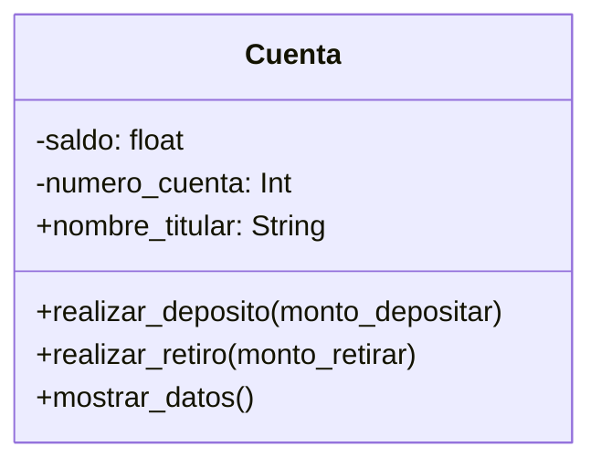

# Escenario
Un banco necesita desarrollar un módulo para gestionar cuentas bancarias. 
Cada cuenta tiene las siguientes caracteristicas:
saldo: Es un dato privado. Solo puede consultar. Se puede modificar únicamente a través de deposito y retiro
deposito: Permite ingresar dinero, incrementando el saldo.
retiro: Permite retirar dinero, siempre y cuando el saldo disponible sea suficiente.
número de cuenta: Es privado. Puede consultarse, pero no puede modificarse una vez asignado.
nombre del titular: Es público. Puede consultarse y modificarse libremente.

# Análisis
Requisitos:
- Gestionar cuentas bancarias dentro de un módulo del banco
- Registrar cada cuenta bancaria con número de cuenta, nombre de titular y un saldo inicial
- Permitir consultar el saldo mediante un atributo protegido
- Modificar el saldo solo a través de deposito y retiro
- Incrementar el saldo al realizar un depósito
- Disminuir el saldo al realizar un retiro si hay fondos suficientes
- Consultar el número de cuenta, pero no modificarlo
- Modificar y consultar libremente el nombre del titular

Objetos:
- Cuenta

Características:
- Cuenta:
    - saldo
    - numero_cuenta
    - nombre_titular

Acciones:
- Cuenta:
    - realizar_deposito(monto_depositar)
    - realizar_retiro(monto_retirar)
    - mostrar_datos()

# Diseño

Clases:
- Cuenta:
  - Nombre: Cuenta
  - Atributos:
      - saldo: float
      - numero_cuenta: Int
      - nombre_titular: String
  - Métodos:
      - realizar_deposito(monto_depositar)
      - realizar_retiro(monto_retirar)
      - mostrar_datos()

