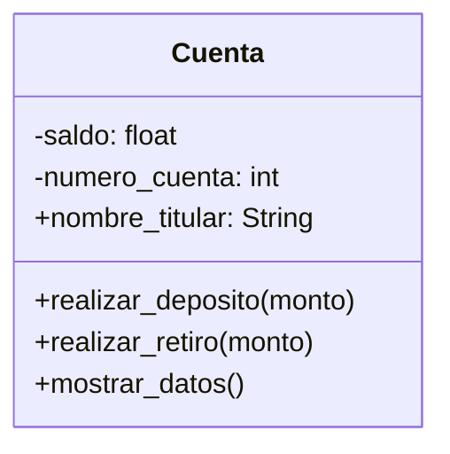

# Escenario
Un banco necesita desarrollar un módulo para gestionar cuentas bancarias. 
Cada cuenta tiene las siguientes caracteristicas:
saldo: Es un dato privado. Solo puede consultar. Se puede modificar únicamente a través de deposito y retiro
deposito: Permite ingresar dinero, incrementando el saldo.
retiro: Permite retirar dinero, siempre y cuando el saldo disponible sea suficiente.
número de cuenta: Es privado. Puede consultarse, pero no puede modificarse una vez asignado.
nombre del titular: Es público. Puede consultarse y modificarse libremente.

# Análisis
Requisitos:
- Un banco necesita desarrollar un módulo de gestión de cuentas bancarias.
- El saldo es un dato privado, solo se consulta y se modifica a través de deposito y retiro.
- El deposito permite ingresar dinero e incrementar el saldo.
- El retiro permite retirar dinero, siempre que el saldo sea suficiente.
- El número de cuenta es privado y solo puede consultarse.
- El nombre del titular es público y puede consultarse y modificarse.

Objetos:
- Cuenta

Características:
- Cuenta:
    - saldo: float
    - numero_cuenta: int
    - nombre_titular: String

Acciones:
- Cuenta:
    - realizar_deposito()
    - realizar_retiro()
    - mostrar_datos()

