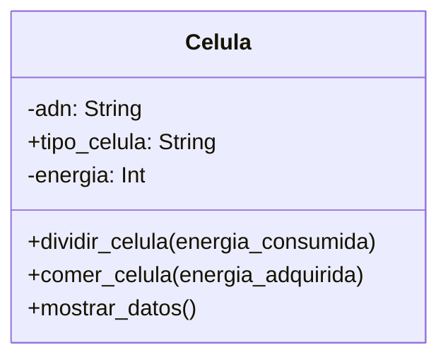

# Escenario
Un médico necesita simular el comportamiento de una célula. 
Cada célula debe cumplir con las siguientes características:
ADN: Se puede consultar pero no puede cambiar.
tipo de célula: Puede consultarse y modificarse libremente.
energía: Es un dato privado. Puede aumentar o disminuir, únicamente mediante las acciones de comer o dividirse.

# Análisis
Requisitos:
- Modelar el comportamiento de una célula en un entorno simulado
- Registrar el ADN de la célula, que es privado y solo puede consultarse
- Registrar el tipo de célula, que puede consultarse y modificarse libremente
- Registrar la energía de la célula, que es privada y solo puede modificarse mediante acciones de comer o dividirse.
- Comer aumenta la energía de la célula
- Dividir disminuye la energía de la célula

Objeto:
- Celula

Características:
- Celula:
    - adn: String
    - tipo_celula: String
    - energia: Int

Acciones:
- Celula:
    - dividir_celula(energia_consumida)
    - comer_celula(energia_adquirida)
    - mostrar_datos()

# Diseño

Clases:
- Celula:
  - Nombre: Celula
  - Atributos:
      - adn: String
      - tipo_celula: String
      - energia: Int
  - Métodos:
      - dividir_celula(energia_consumida)
      - comer_celula(energia_adquirida)
      - mostrar_datos()

