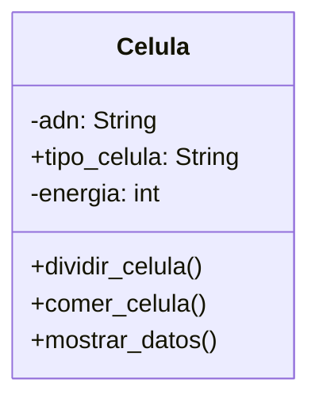

# Escenario
Un médico necesita simular el comportamiento de una célula. 
Cada célula debe cumplir con las siguientes características:
ADN: Se puede consultar pero no puede cambiar.
tipo de célula: Puede consultarse y modificarse libremente.
energía: Es un dato privado. Puede aumentar o disminuir, únicamente mediante las acciones de comer o dividirse.

# Análisis
Requisitos:
- Simular el comportamiento de una célula.
- El AND se puede consultar, pero no cambiar.
- El tipo de célula puede consultarse y modificarse.
- La energía es un dato que puede aumentar o disminuir, solo con las acciones de comer o dividir.

Objeto:
- Celula

Características:
- Celula:
    - adn: String
    - tipo_celula: String
    - energia: int

Acciones:
- Celula:
    - dividir_celula()
    - comer_celula()
    - mostrar_datos()

