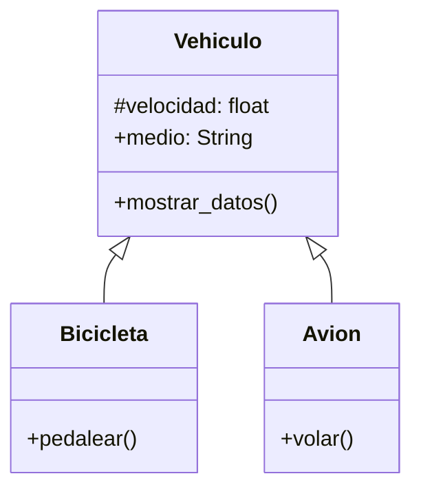

# Escenario
Una empresa de transporte desea desarrollar una simulación que represente el comportamiento de sus distintos vehículos.
Todo vehículo posee las siguientes características:
velocidad: Es un dato protegido. Puede consultarse, pero solo modificarse mediante acciones específicas.
medio: Representa el entorno en el que se desplaza el vehículo (por ejemplo, terrestre, acuático, aéreo). Puede consultarse y modificarse libremente.
Existen dos tipos de vehículos con características específicas:
Bicicleta: Incrementar su velocidad mediante la acción de pedalear.
Avión: Incrementar su velocidad mediante la acción de volar.

# Análisis
Requisitos:
- Representar el comportamiento de vehículos utilizados por una empresa de transporte
- Registrar la velocidad de cada vehículo como un dato protegido
- Consultar la velocidad del vehículo sin permitir su modificación directa
- Registrar el medio en el que se desplaza el vehículo (terrestre, acuatico, aereo)
- Consultar y modificar el medio del vehículo libremente
- Incrementar la velocidad de la bicicleta mediante la acción de pedalear
- Incrementar la velocidad del avión mediante la acción de volar

Objetos:
- Vehiculo (clase padre)
- Bicicleta (clase hija)
- Avion (clase hija)

Características:
- Vehiculo:
  - velocidad
  - medio
- Bicicleta:
  - (sin caracteristicas)
- Avion:
  - (sin caracteristicas)

Acciones:
- Vehiculo
  - mostrar_datos()
- Bicicleta:
  - pedalear()
- Avion:
  - volar()

# Diseño

Clases:
- Vehiculo:
  - Nombre: Vehiculo
  - Atributos:
      - velocidad: float
      - medio: String
  - Métodos:
      - mostrar_datos()
- Bicicleta:
  - Nombre: Bicicleta
  - Atributos:
      - (hereda de vehiculo)
  - Métodos:
      - pedalear()
- Avion:
  - Nombre: Avion
  - Atributos:
      - (hereda de vehiculo)
  - Métodos:
      - volar()

