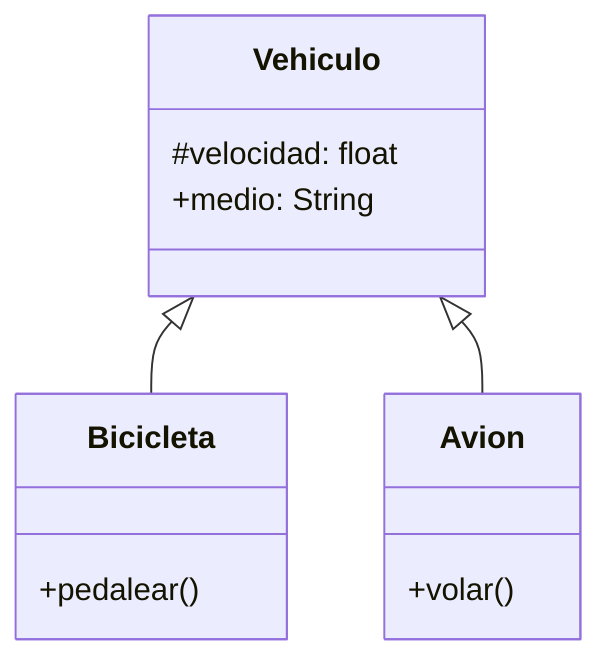

# Escenario
Una empresa de transporte desea desarrollar una simulación que represente el comportamiento de sus distintos vehículos.
Todo vehículo posee las siguientes características:
velocidad: Es un dato protegido. Puede consultarse, pero solo modificarse mediante acciones específicas.
medio: Representa el entorno en el que se desplaza el vehículo (por ejemplo, terrestre, acuático, aéreo). Puede consultarse y modificarse libremente.
Existen dos tipos de vehículos con características específicas:
Bicicleta: Incrementar su velocidad mediante la acción de pedalear.
Avión: Incrementar su velocidad mediante la acción de volar.

# Análisis
Requisitos:
- Desarrollar una simulación que represente el comportamiento de vehículos.
- La velocidad es un dato protegido, puede consultarse, pero se modifica con acciones específicas.
- El medio representa el entorno donde se desplaza el vehículo, puede consultarse y modificarse.
- Bicicleta es un tipo de vehículo cuya velocidad se incrementa mediante la acción de pedalear.
- Avión es un tipo de vehículo cuya velocidad se incrementa mediante la acción de volar.

Objetos:
- Vehiculo (clase padre)
- Bicicleta (clase hija)
- Avion (clase hija)

Características:
- Vehiculo:
  - velocidad: float
  - medio: String (terrestre, acuatico, aereo)
- Bicicleta:
  - (sin caracteristicas)
- Avion:
  - (sin caracteristicas)

Acciones:
- Vehiculo
  - (sin acciones)
- Bicicleta:
  - pedalear()
- Avion:
  - volar()

