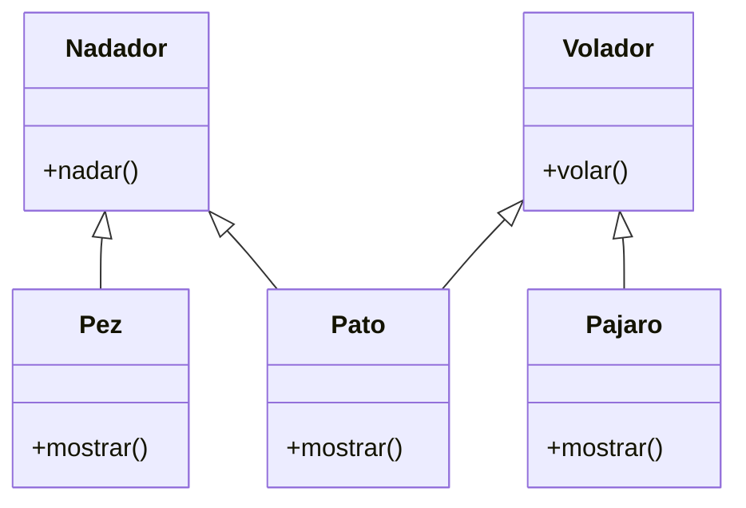

# Escenario
Debes desarrollar un videojuego tipo aventura, donde los personajes tiene distintas habilidades
Cada personaje pertenece a uno o más tipos que definen sus comportamientos:
Nadador: Puede ejecutar la acción nadar(), que representa la acción de desplazarse en el agua.
Volador: Puede ejecutar la acción volar(), que representa la acción de desplazarse por el aire.
En el juego existen tres personajes principales, cada uno con habilidades específicas:
Pez: tiene la habilidad de nadar.
Pájaro: tiene la habilidad de volar.
Pato: tiene ambas habilidades, puede nadar y volar.
Cada personaje debe contar con un método mostrar() que indique el tipo de personaje y su habilidad principal o combinada.

# Análisis
Requisitos:
- Representar personajes de un videojuego tipo aventura
- Definir habilidades de desplazamiento mediante tipos de personaje
- Ejecutar la acción de nadar para los personajes de tipo nadador
- Ejecutar la acción de volar para los personajes de tipo volador
- Permitir que un personaje posea una o más habilidades
- Mostrar el tipo de personaje y sus habilidades mediante un método mostrar

Objetos:
- Nadador (clase padre)
- Volador (clase padre)
- Pez (clase hija)
- Pajaro (clase hija)
- Pato (hereda de Nadador y Volador)

Caracteristicas:
- Nadador:
  - (sin características)
- Volador:
  - (sin características)
- Pez:
  - (sin características)
- Pajaro:
  - (sin características)
- Pato:
  - (sin características)

Acciones:
- Nadador:
  - nadar()
- Volador:
  - volar()
- Pez:
  - mostrar()
- Pajaro:
  - mostrar()
- Pato:
  - mostrar()

# Diseño

Clases:
- Nadador:
  - Nombre: Nadador
  - Atributos:
      - (sin atributos)
  - Métodos:
      - nadar()
- Volador:
  - Nombre: Volador
  - Atributos:
      - (sin atributos)
  - Métodos:
      - volar()
- Pez:
  - Nombre: Pez
  - Atributos:
      - (sin atributos)
  - Métodos:
      - (hereda de nadador)
      - mostrar()
- Pajaro:
  - Nombre: Pajaro
  - Atributos:
      - (sin atributos)
  - Métodos:
      - (hereda de volador)
      - mostrar()
- Pato:
  - Nombre: Pato
  - Atributos:
      - (sin atributos)
  - Métodos:
      - (hereda de nadador y volador)
      - mostrar()

