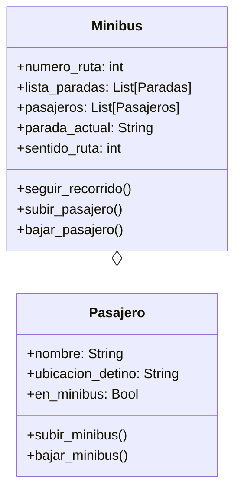

# Escenario
En su trayecto diario al trabajo, las personas pueden abordar distintos minibuses. Cada minibus está identificado por un número de ruta y sigue un recorrido compuesto por varias paradas (ubicaciones). Por otro lado, cada pasajero tiene un nombre y una ubicación de destino a la que desea llegar.
Los pasajeros pueden subir o bajar del minibus en cualquier parada, pero bajo las siguientes condiciones:
- Un pasajero solo puede subir si el recorrido del minibus incluye su destino entre las paradas programadas.
- Un pasajero solo puede bajar si la parada actual del minibus coincide con su destino.
- Las paradas son circulares: al llegar al final del recorrido, el minibus invierte su lista de paradas y regresa en sentido contrario.
Toma en cuenta las siguientes características:
- Un minibus tiene una lista de paradas programadas (ejemplo: ["Arce", "Prado", "Perez"]).
- Un minibus puede transportar múltiples pasajeros.
- Simular el movimiento del minibus entre paradas y las acciones de subida y bajada de pasajeros.

# Análisis
Requisitos:
- Abordar un minibus en el trayecto diario al trabajo
- Minubus tiene un número de ruta, sigue un recorrido compuesto por paradas y puede transportar múltiples pasajeros
- Pasajero tiene un nombre y una ubicación de destino
- Subir a un minibus solo si el recorrido incluye el destino entre las paradas programadas
- Bajar del minibus si la parada actual coincide con su destino
- Paradas circulares, al llegar al final del recorrido el minibus invierte su lista de paradas y regresa

Objetos:
- Minibus
- Pasajero

Características:
- Minibus:
    - numero_ruta: int
    - lista_paradas: List[Paradas]
    - pasajeros: List[Pasajeros]
    - parada_actual: String
    - sentido_ruta: int
- Pasajero:
    - nombre: String
    - ubicacion_destino: String
    - en_minibus: Bool

Acciones:
- Minibus:
    - seguir_recorrido()
    - subir_pasajero()
    - bajar_pasajero()
- Pasajero:
    - subir_minibus()
    - bajar_minibus()

