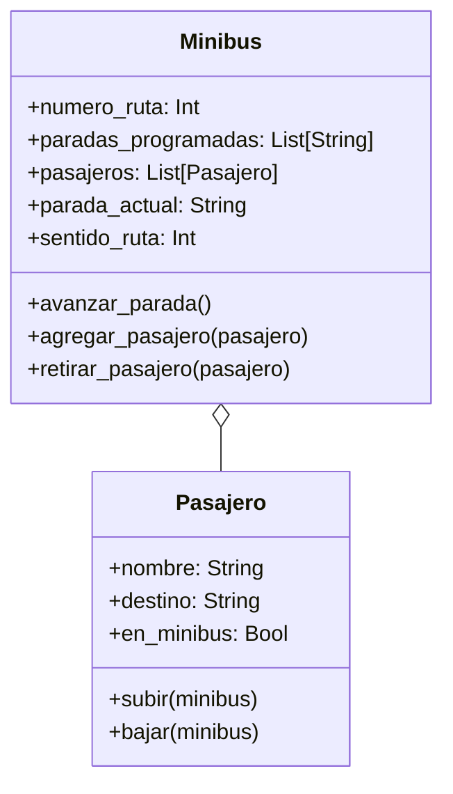

# Escenario
En su trayecto diario al trabajo, las personas pueden abordar distintos minibuses. Cada minibus está identificado por un número de ruta y sigue un recorrido compuesto por varias paradas (ubicaciones). Por otro lado, cada pasajero tiene un nombre y una ubicación de destino a la que desea llegar.
Los pasajeros pueden subir o bajar del minibus en cualquier parada, pero bajo las siguientes condiciones:
- Un pasajero solo puede subir si el recorrido del minibus incluye su destino entre las paradas programadas.
- Un pasajero solo puede bajar si la parada actual del minibus coincide con su destino.
- Las paradas son circulares: al llegar al final del recorrido, el minibus invierte su lista de paradas y regresa en sentido contrario.
Toma en cuenta las siguientes características:
- Un minibus tiene una lista de paradas programadas (ejemplo: ["Arce", "Prado", "Perez"]).
- Un minibus puede transportar múltiples pasajeros.
- Simular el movimiento del minibus entre paradas y las acciones de subida y bajada de pasajeros.

# Análisis
Requisitos:
- Representar el recorrido de un minibus identificado por un número de ruta
- Registrar las paradas programadas que conforman el recorrido del minibus
- Permitir el transporte de múltiples pasajeros dentro de un minibus
- Registrar el nombre y el destino de cada pasajero
- Permitir que un pasajero suba al minibus solo si su destino se encuentra en el recorrido
- Permitir que un pasajero baje del minibus únicamente cuando la parada actual coincida con su destino
- Simular el movimiento del minibus entre paradas de forma circular, invirtiendo el sentido al llegar al final
  del recorrido

Objetos:
- Minibus
- Pasajero

Características:
- Minibus:
    - numero_ruta
    - paradas_programadas
    - pasajeros
    - parada_actual
    - sentido_ruta
- Pasajero:
    - nombre
    - destino
    - en_minibus

Acciones:
- Minibus:
    - avanzar_parada()
    - agregar_pasajero()
    - retirar_pasajero()
- Pasajero:
    - subir()
    - bajar()

# Diseño

Clases:
- Minibus:
  - Nombre: Minibus
  - Atributos:
      - numero_ruta: Int
      - paradas_programadas: List[String]
      - pasajeros: List[Pasajero]
      - parada_actual: String
      - sentido_ruta: Int
  - Métodos:
      - avanzar_parada()
      - agregar_pasajero(pasajero)
      - retirar_pasajero(pasajero)
- Pasajero:
  - Nombre: Pasajero
  - Atributos:
      - nombre: String
      - destino: String
      - en_minibus: Bool
  - Métodos:
      - subir(minibus)
      - bajar(minibus)

