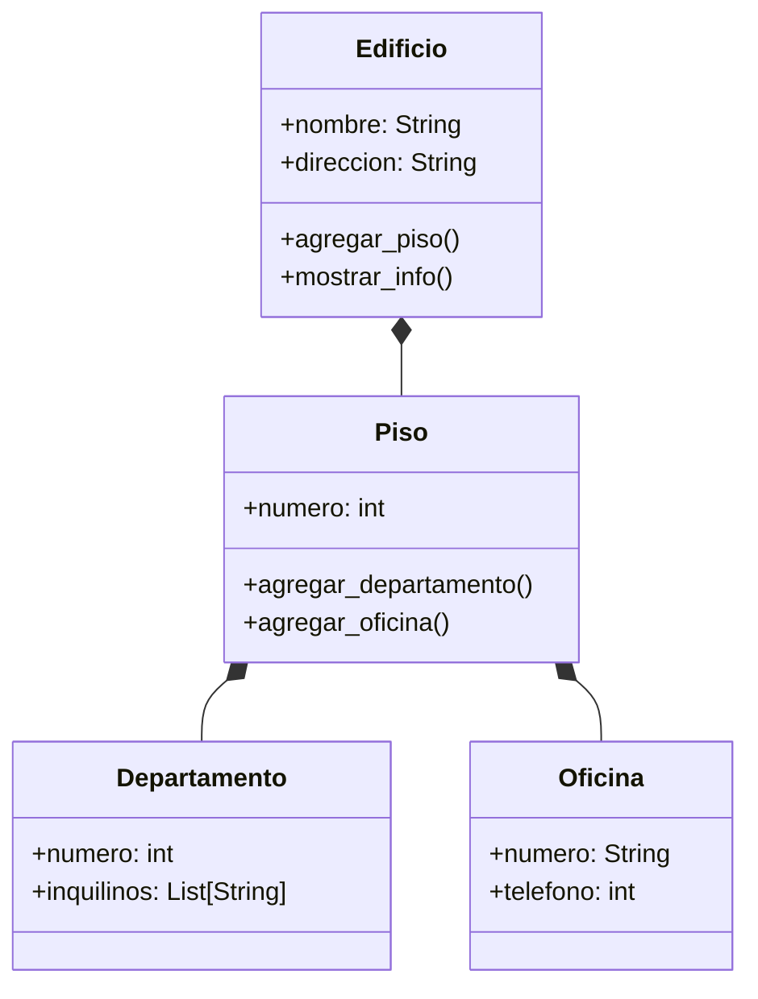

# Escenario
Se debe modelar un edificio ubicado en la ciudad de La Paz, compuesto por 3 pisos. Cada piso contiene una combinación de departamentos y oficinas
Cada departamento tiene un número que comienza con el número del piso seguido de un número de unidad (por ejemplo: 201, 304).
Cada oficina tiene un número que comienza con el número del piso seguido de una letra (por ejemplo: 2A, 3C).
Además:
El edificio tiene direccion y nombre.
Los pisos tienen un atributo numero
Las oficinas cuentan con un atributo telefono.
Los departamentos tienen un atributo inquilinos.
El sistema debe permitir:
Crear un edificio con sus pisos correspondientes.
Agregar departamentos y oficinas a cada piso.
Acceder y mostrar la información del edificio de forma organizada y jerárquica

# Análisis
Requisitos:
- Crear un edificio compuesto por 3 pisos, cada piso tiene departamentos y oficinas
- El edificio tiene nombre y dirección
- Los pisos tienen un atributo número
- Cada departamento tiene un número que comienza con el número de piso seguido de un número de unidad
- Cada oficina tiene un número que comienza con el número de piso seguido de una letra
- Los departamentos tienen un atributo inquilinos
- Las oficinas tienen un atributo teléfono
- Agregar departamentos y oficinas a cada piso
- Acceder y mostrar la información del edificio

Objetos:
- Edificio
- Piso
- Departamento
- Oficina

Características:
- Edificio:
    - nombre: String
    - direccion: String
- Piso:
    - numero: int
- Departamento:
    - numero: int
    - inquilinos: List[String]
- Oficina:
    - numero: String
    - telefono: int
  
Acciones:
- Edificio:
    - agregar_piso()
    - mostrar_info()
- Piso:
    - agregar_departamento()
    - agregar_oficina()
- Departamento:
    - (sin acciones)
- Oficina:
    - (sin acciones)

