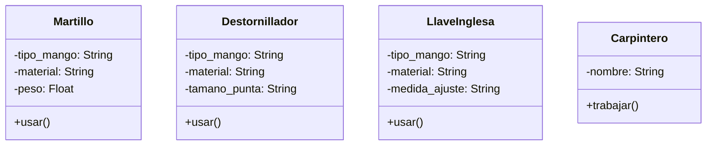

En un taller de carpintería, los trabajadores utilizan diferentes herramientas para construir muebles, reparar objetos o ajustar piezas.
Cada herramienta tiene una función específica, pero todas pueden ser utilizadas por el carpintero de manera similar.
Por ejemplo:
El martillo se usa para clavar clavos
El destornillador se usa para ajustar tornillos
La llave inglesa se usa para apretar tuercas
El carpintero no necesita saber el tipo exacto de herramienta que está utilizando, solo necesita que la herramienta pueda ejecutar la acción usar()

# Análisis
Requisitos:
- El carpintero puede usar diferentes herramientas para construir muebles, reparar objetos o ajustar piezas
- Cada herramienta debe tener su propio método usar()
- Martillo se usa para clavar clavos
- Destornillador se usa para ajustar tornillos
- Llave inglesa se usa para apretar tuercas
- El carpintero no necesita saber el tipo exacto de herramienta que está utilizando

Objetos:
- Martillo
- Destornillador
- Llave inglesa
- Carpintero

Características:
- Martillo:
      - tipo_mango
      - material
      - peso
- Destornillador:
      - tipo_mango
      - material
      - tamaño_punta
- Llave inglesa:
      - tipo_mango
      - material
      - medida_ajuste
- Carpintero:
      - nombre

Acciones:
- Martillo: usar clavar clavos
- Destornillador: usar ajustar tornillos
- Llave inglesa: usar apretar tuercas
- Carpintero: trabajar

