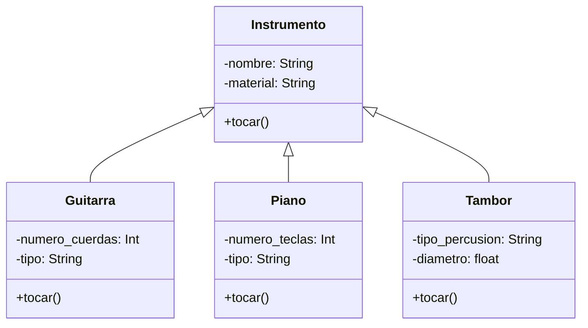

Una aplicación de aprendizaje musical permite a los usuarios practicar con distintos instrumentos. Cada instrumento tiene una forma particular de producir sonido, pero todos pueden ser tocados por el usuario mediante una acción común.
La guitarra hace "strum"
El piano hace "plin"
El tambor hace "boom"
Aunque cada instrumento suena distinto, todos comparten una característica común: pueden ejecutar la acción tocar()
Crea una clase base llamada Instrumento que defina el método tocar().
Implementa las clases derivadas Guitarra, Piano y Tambor, cada una con su propia versión del método tocar() que imprima su sonido característico.

# Análisis
Requisitos:
- Aplicación de aprendizaje musical permite a los usuarios practicar con distintos instrumentos
- Cada instrumento produce un sonido particual, pero todos pueden ser tocados por el usuario con una acción común
- La guitarra produce el sonido strum
- El piano produce el sonido plin
- El tambor produce el sonido boom
- Todos los instrumentos ejecutan la accion tocar()
- Crear una clase base llamada Instrumento que defina el método tocar()
- Deben incluir atributos coherentes con su función y comportamiento

Objetos:
- Instrumento
- Guitarra
- Piano
- Tambor

Características:
- Instrumento:
    - nombre: String
    - material: String
- Guitarra:
    - numero_cuerdas: Int
    - tipo: String
- Piano:
    - numero_teclas: Int
    - tipo: String
- Tambor:
    - tipo_percusion: String
    - diametro: float

Acciones:
- Instrumento: tocar()
- Guitarra: tocar()
- Piano: tocar()
- Tambor: tocar()

