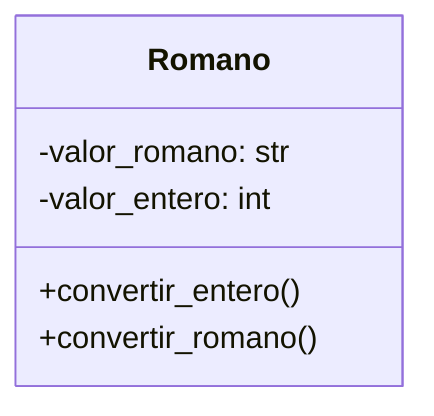

Un profesor de matemáticas utiliza una calculadora de números romanos para enseñar aritmética clásica. 
Cada número se representa mediante una letra o combinación de letras romanas, como:
I = 1, V = 5, X = 10, L = 50, C = 100
Crea la clase Romano que permita sumar números romanos usando el operador +
El resultado debe ser un nuevo objeto de tipo Romano con el valor "XV" (equivalente a 15).
Esto se logra mediante la sobrecarga del operador +, definiendo su comportamiento dentro de la clase Romano.

# Análisis
Requisitos:
- Calculadora de números romanos para enseñar aritmética clásica
- Los números romanos se representarán mediante letras romanas (I = 1, V = 5, X = 10, L = 50, C = 100)
- Los números romanos pueden sumarse entre sí
- La suma de dos números romanos generará un nuevo objeto de tipo Romano
- El operador + debe ser sobrecargado para realizar la suma

Objetos:
- Romano

Características:
- valor_romano: String
- valor_entero: int
  
Acciones:
- Romano: convertir_entero(), convertir_romano()

