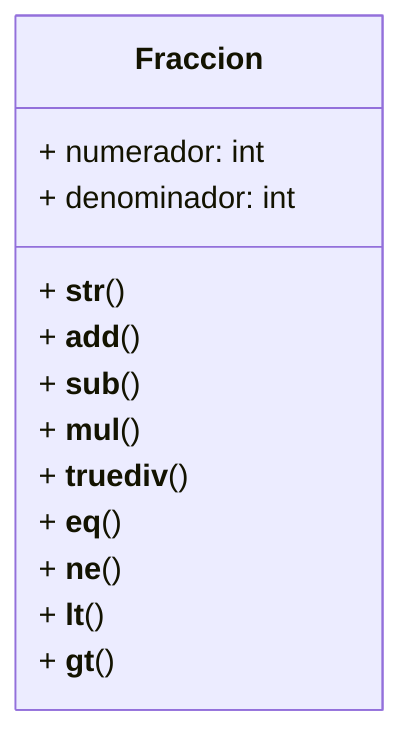

Un profesor de matemáticas necesita una calculadora de fracciones para enseñar conceptos básicos de aritmética. 
Cada fracción se representa mediante un numerador y un denominador.
Por ejemplo, la fracción 3/4 tiene un numerador igual a 3 y un denominador igual a 4.

Crea la clase Fraccion que permita representar y operar con fracciones de forma intuitiva utilizando métodos especiales (dunder methods) y cumpla con los siguientes:

Representación: "numerador/denominador"
Puede sumar con otra fracción, operador: +
Puede restar con otra fracción, operador: -
Puede multiplicar con otra fracción, operador: *
Puede dividir con otra fracción, operador: /

Además, la clase Fraccion debe permitir comparar:
Con otra fracción para igualdad, operador: ==
Con otra fracción para menor que, operador: <
Con otra fracción para mayor que, operador: >
Con otra fracción para desigualdad, operador: !=

# Análisis
Requisitos:
- Crear una calculadora de fracciones para enseñar conceptos básicos de aritmética
- Cada fracción se representa mediante un numerador y denominador ➡ "numerador/denominador"
- Las fracciones pueden sumarse con el operador +
- Las fracciones pueden restarse con el operador -
- Las fracciones pueden multiplicarse con el operador *
- Las fracciones pueden dividirse con el operador /
- Las fracciones pueden compararse para ver si son iguales, con el operador ==
- Las fracciones pueden compararse para ver si la primera es menor que la otra, con el operador <
- Las fracciones pueden compararse para ver si la primera es mayor que la otra, con el operador >
- Las fracciones pueden compararse para ver si son diferentes, con el operador !=

Objetos:
- Fraccion

Características:
- Fraccion: numerador, denominador

Acciones:
- Fraccion: representacion, sumar, restar, multiplicar, dividir
- Fraccion: igualdad, menor que, mayor que, desigualdad

