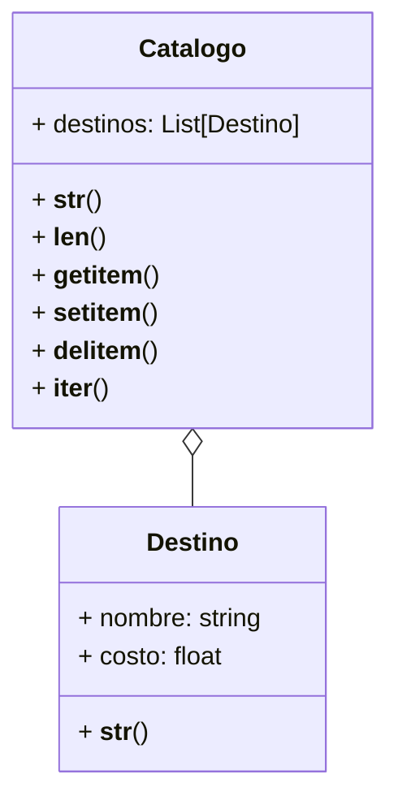

Una agencia de viajes gestiona un catálogo digital que contiene información sobre destinos turísticos. Cada destino tiene un nombre y un costo asociado, y la agencia desea que el catálogo permita visualizar, modificar y recorrer los destinos de forma intuitiva.

Los Destinos se representan como:
"[destino] ➡ [costo] USD"

El Catálogo de Destinos se representa como:
🗺 Destinos 🗺
1. destino1
2. destino2
...
n. destinoN

El catálogo debe permitir:

Ver la longitud del catálogo, len(catalogo)
Acceder por su índice, catalogo[indice]
Agregar destinos, catalogo[indice]=destino
Eliminar destinos, del catalogo[indice]
Iterar sobre los destinos, for destino in catalogo
Ver el catálogo en el formato especificado.

# Análisis
Requisitos:
- La agencia debe gestionar un catálogo digital de destinos turísticos.
- Cada destino tiene un nombre y un costo en USD.
- El catálogo debe permitir visualizar, modificar y recorrer los destinos de forma intuitiva.
- Existe una relación de agregación entre Destinos y Catálogo.
- Los destinos se representan como: [destino] ➡ [costo] USD
- El catálogo se representa como:

  🗺 Destinos 🗺
  1. destino1
  2. destino2
    ...
- El catálogo debe poder saber cuantos destinos tiene ➡ len(catalogo).
- El catálogo debe poder acceder a los destinos por su índice ➡ catalogo[indice].
- El catálogo debe poder agregar nuevos destinos ➡ catalogo[indice]=destino.
- El catálogo debe poder eliminar destinos ➡ del catalogo[indice].
- El catálogo debe poder iterar sobre los destinos ➡ for destino in catalogo.
- Se debe mostrar el catálogo en el formato especificado.

Objetos:
- Destino
- Catalogo

Características:
- Destino: nombre, costo
- Catalogo: lista de destinos

Acciones:
- Destino: representacion
- Catalogo: longitud, representacion, acceso a destinos por indice, agregar, eliminar, iterar

