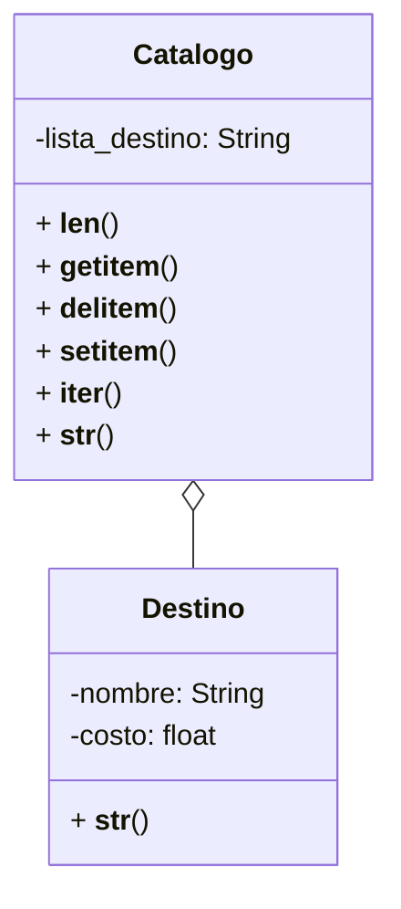

Una agencia de viajes gestiona un catálogo digital que contiene información sobre destinos turísticos. Cada destino tiene un nombre y un costo asociado, y la agencia desea que el catálogo permita visualizar, modificar y recorrer los destinos de forma intuitiva.

Los Destinos se representan como:
"[destino] ➡ [costo] USD"

El Catálogo de Destinos se representa como:
🗺 Destinos 🗺
1. destino1
2. destino2
...
n. destinoN

El catálogo debe permitir:

Ver la longitud del catálogo, len(catalogo)
Acceder por su índice, catalogo[indice]
Agregar destinos, catalogo[indice]=destino
Eliminar destinos, del catalogo[indice]
Iterar sobre los destinos, for destino in catalogo
Ver el catálogo en el formato especificado.

# Análisis
Requisitos:
- Gestionar un catálogo digital de destinos durísticos.
- Cada destino tiene un nombre y un costo en USD.
- Los destinos se representan como: [destino] ➡ [costo] USD
- La representación del catálogo debe ser:
  🗺 Destinos 🗺
  1. destino1
  2. destino2
    ...
- El catálogo permite: obtener su longitud, acceder por su índice, agregar destinos, eliminar destinos e iterar sobre los destinos.
- Mostrar el catálogo en el formato especificado.

Objetos:
- Destino
- Catalogo

Características:
- Destino: nombre, costo
- Catalogo: lista_destinos

Acciones:
- Destino: mostrar_destino
- Catalogo: obtener_longitud, acceder_indice, eliminar_destino, modificar_indice, iterar_catalogo, mostrar_catalogo

