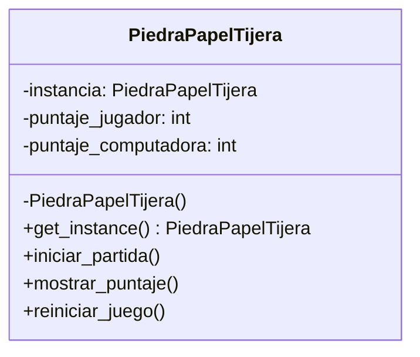

Crea el juego Piedra, Papel o Tijera implementando el patrón de diseño Singleton.
En esta versión, un jugador compite contra la computadora, la cual selecciona aleatoriamente entre las tres opciones disponibles:
Piedra , Papel , Tijera.
Se debe registrar las partidas ganadas tanto por el jugador como por la computadora, manteniendo el control del puntaje dentro de la única instancia del juego.
Implementa la clase PiedraPapelTijera aplicando el patrón de diseño Singleton, asegurando que exista una única instancia del juego durante toda la ejecución.

La clase debe incluir los siguientes métodos:

iniciarPartida(): Permite jugar una ronda contra la computadora
mostrarPuntaje(): Muestra el puntaje acumulado del jugador y de la computadora.
reiniciarJuego(): Restablece los puntajes a cero.

Además, se debe implementar un menú interactivo en consola con las siguientes opciones:
1. Iniciar una nueva partida
2. Mostrar puntajes
3. Reiniciar el juego
4. Salir

# Análisis
Requisitos:
- Crear el juego Piedra, Papel o Tijera
- Un jugador compite contra una computadora
- La computadora selecciona aleatoriamente tres opciones disponibles: Piedra, Papel, Tijera
- Se debe registrar las partidas ganadas por el jugador y la computadora
- El juego debe implementarse siguiendo el patrón Singleton, asegurando que exista solo una instancia en la ejecución
- El juego permite iniciar una partida, jugando una ronda contra la computadora
- El juego muestra el puntaje acumulado del jugador y la computadora
- El juego permite reiniciar el juego, restableciendo los puntajes a cero
- El juego debe tener un menú interactivo

Objetos:
- PiedraPapelTijera: Representa el juego en sí

Características:
- PiedraPapelTijera: puntaje del jugardor, puntaje de la computadora

Acciones:
- PiedraPapelTijera: iniciar partida, mostrar puntaje, reiniciar el juego

