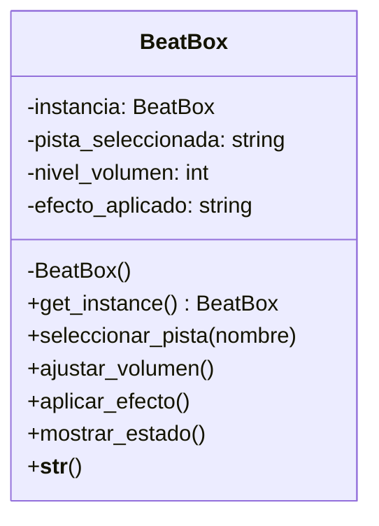

Un DJ requiere una nueva consola de mezcla llamada BeatBox, capaz de mezclar pistas de audio en tiempo real.
La consola debe permitir:
Seleccionar una pista de audio
Ajustar el volumen (subir o bajar)
Mostrar el estado actual de la consola (pista seleccionada y nivel de volumen)
Aplicar un único efecto de sonido a la vez, entre las opciones: eco, reverb o distorsión
Crea la clase BeatBox implementando el patrón de diseño Singleton 

La clase debe incluir los siguientes métodos:
seleccionar_pista() → Permite elegir una pista de audio.
ajustar_volumen() → Permite subir o bajar el volumen.
aplicar_efecto() → Aplica un efecto de sonido (eco, reverb o distorsión).
mostrar_estado() → Muestra el estado actual de la consola (pista seleccionada y nivel de volumen).

El programa debe ofrecer un menú con las siguientes opciones:
1. Ingresar el nombre de la pista de audio
2. Ajustar volumen
3. Aplicar efecto de sonido
4. Mostrar estado actual
5. Salir

# Análisis
Requisitos:
- Crear una consola de mezcla de pistas de audio en tiempo real para un DJ
- Permitir seleccionar una pista de audio
- Permitir ajustar el volumen, subir o bajar
- Aplicar un único efecto de sonido a la vez, entre estas opciones: eco, reverb o distorsión
- Mostrar el estado actual de la consola, pista seleccionada y nivel de volumen
- Debe ofrecer un menú de opciones interactivo para seleccionar pista, ajustar volumen, aplicar efecto, mostrar estado y salir
- Implementar el patrón de diseño Singleton, garantizando que exista una única consola BeatBox durante toda la ejecución

Objetos:
- BeatBox: Representa a la consola

Características:
- BeatBox: pista seleccionada, nivel de volumen, efecto aplicado

Acciones:
- BeatBox: seleccionar pista, ajustar volumen, aplicar efecto, mostrar el estado, representacion

