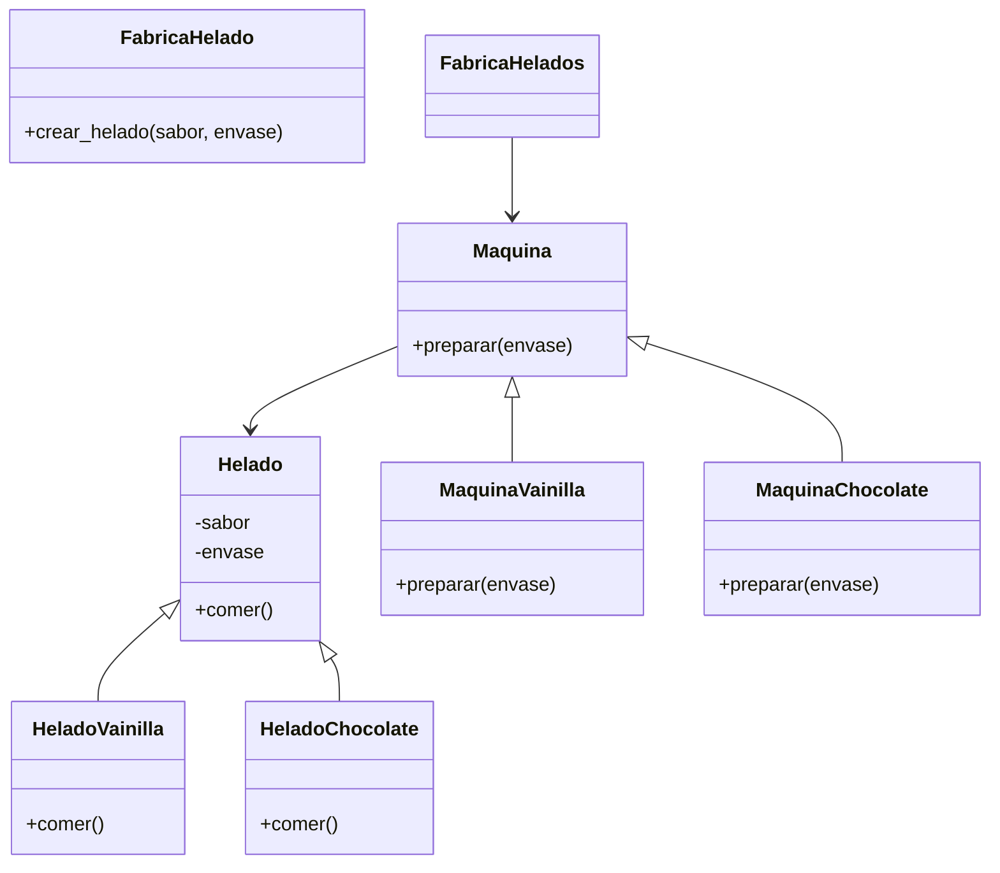

# Análisis
Requisitos:
- Pedir helados de vainilla o chocolate en una heladería
- Elegir si se desea el helado en cono o vaso
- Usar la máquina para preparar cada sabor
- Preparar helados de vainilla solo con la máquina de vainilla
- Preparar helados de chocolate solo con la máquina de chocolate
- Compartir la característica de poder comer, para todos los helados
- Envasar los helados en cono o vaso
- Mostrar los helados como: "[sabor] 🍦 en [envase]"
- Crear un menú de opciones para pedidos de helado:
  🍨 Pedidos de Helado 🍨
  1. Vainilla en Cono
  2. Vainilla en Vaso
  3. Chocolate en Cono
  4. Chocolate en Vaso
- Registrar pedidos hasta que el usuario escriba "salir"
- Utilizar una Fábrica de Helados para decidir que máquina usar

Objetos:
- Helado
- Helado de vainilla
- Helado de chocolate
- Maquina
- Maquina de vainilla
- Maquina de chocolate
- Fabrica de helados (Factory)

Caracteristicas:
- Helado
    - Sabor
    - Envase
- Helado de vainilla
    - Helado
- Helado de chocolate
    - Helado   
- Maquina
    - (sin caracteristicas)
- Maquina de vainilla
    - Maquina
- Maquina de chocolate
    - Maquina
- Fabrica de helados:
    - (sin caracteristicas)

Acciones:
- Helado
    - Comer
- Helado de vainilla
    - Comer
- Helado de chocolate
    - Comer
- Maquina
    - Preparar
- Maquina de vainilla
    - Preparar
- Maquina de chocolate
    - Preparar
- Fabrica de helados
    - Crear helado

# Diseño:
Clases:
- Helado 🍨:
    - Nombre: Helado
    - Atributos:
        - sabor
        - envase
    - Métodos:
        - comer()
- Helado de vainilla:
    - Nombre: HeladoVainilla
    - Atributos:
        - Helado
    - Métodos:
        - comer()
- Helado de chocolate:
    - Nombre: HeladoChocolate:
    - Atributos:
        - Helado
    - Métodos:
        - comer()
- Maquina ⚙️:
    - Nombre: Maquina
    - Atributos:
        - (sin atributos)
    - Métodos:
        - preparar()
- Maquina de vainilla:
    - Nombre: MaquinaVainilla
    - Atributos:
        - Maquina
    - Métodos:
        - preparar()
- Maquina de chocolate:
    - Nombre: MaquinaChocolate
    - Atributos:
        - Maquina
    - Métodos:
        - preparar()
- Fabrica de helados:
    - Nombre: FabricaHelados
    - Atributos:
        - (sin atributos)
    - Métodos:
        - crear_helado(sabor, envase)

