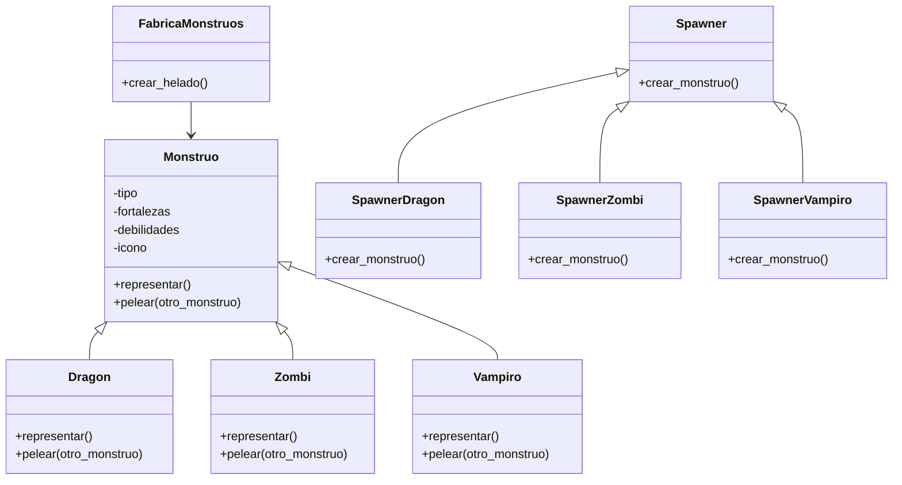

# Análisis
Requisitos:
- Crear un simulador de batalla de monstruos para dos jugadores
- Seleccionar unos de los siguientes tipos de monstruos: Dragón, Zombi, Vampiro
- Definir fortalezas y debilidades según el tipo:
  - Dragón:
    - Fuerte contra Zombi
    - Débil contra Vampiro
    - Igual contra Dragón
  - Zombi:
    - Fuerte contra Vampiro
    - Débil contra Dragón
    - Igual contra Zombi
  - Vampiro:
    - Fuerte contra Dragón
    - Débil contra Zombi
    - Igual contra Vampiro
- Determinar el resultado de la batalla comparando las fortalezas y debilidades
- Terminar el juego si uno de los jugadores escribe "salir"
- Representar cada monstruo en este formato: "[monstruo] 🧟‍♂️ listo para luchar"
- Implementar un menú de selección con esta estructura:

    🧩 Selección de Monstruos 🧩

    Jugador 1: Elige tu monstruo (dragón/zombi/vampiro):

    Jugador 2: Elige tu monstruo (dragón/zombi/vampiro):

    Escribe "salir" para terminar.
- Utilizar una Fábrica de monstruos para decidir que monstruo crear mediante spawners

Objetos:
- Monstruo
- Dragon
- Zombi
- Vampiro
- Spawner
- Spawner de Dragon
- Spawner de Zombi
- Spawner de Vampiro
- Fabrica de monstruos (Factory)

Caracteristicas:
- Monstruo:
    - Tipo
    - Fortalezas
    - Debilidades
    - icono
- Dragon:
    - Monstruo
- Zombi:
    - Monstruo   
- Vampiro:
    - Monstruo
- Spawner:
    - (sin caracteristicas)
- Spawner de Dragon
    - Spawner
- Spawner de Zombi:
    - Spawner
- Spawner de Vampiro:
    - Spawner
- Fabrica de monstruos:
    - (sin caracteristicas)

Acciones:
- Monstruo
    - Representar
    - pelear(otro_monstruo)
- Dragon
    - Representar
    - pelear(otro_monstruo)
- Zombi
    - Representar
    - pelear(otro_monstruo)
- Vampiro
    - Representar
    - pelear(otro_monstruo)
- Spawner
    - Crear
- Spawner de Dragon
    - Crear
- Spawner de Zombi
    - Crear 
- Spawner de Vampiro
    - Crear 
- Fabrica de monstruos
    - Crear monstruo

# Diseño:
Clases:
- Monstruo 🧌:
    - Nombre: Monstruo
    - Atributos:
        - tipo
        - fortalezas
        - debilidades
        - icono
    - Métodos:
        - representar()
        - pelear(otro_monstruo)
- Dragon 🐉:
    - Nombre: Dragon
    - Atributos:
        - Monstruo
    - Métodos:
        - representar()
        - pelear(otro_monstruo)
- Zombi 🧟‍♂️:
    - Nombre: Zombi:
    - Atributos:
        - Monstruo
    - Métodos:
        - representar()
        - pelear(otro_monstruo)
- Vampiro 🧛‍♂️:
    - Nombre: Vampiro:
    - Atributos:
        - Monstruo
    - Métodos:
        - representar()
        - pelear(otro_monstruo)
- Spawner:
    - Nombre: Spawner
    - Atributos:
        - (sin atributos)
    - Métodos:
        - crear()
- Spawner de dragon:
    - Nombre: SpawnerDragon
    - Atributos:
        - Spawner
    - Métodos:
        - crear()
- Spawner de Zombi:
    - Nombre: SpawnerZombi
    - Atributos:
        - Spawner
    - Métodos:
        - crear()
- Spawner de Vampiro:
    - Nombre: SpawnerVampiro
    - Atributos:
        - Spawner
    - Métodos:
        - crear()
- Fabrica de monstruos:
    - Nombre: FabricaMonstruos
    - Atributos:
        - (sin atributos)
    - Métodos:
        - crear_monstruo()

