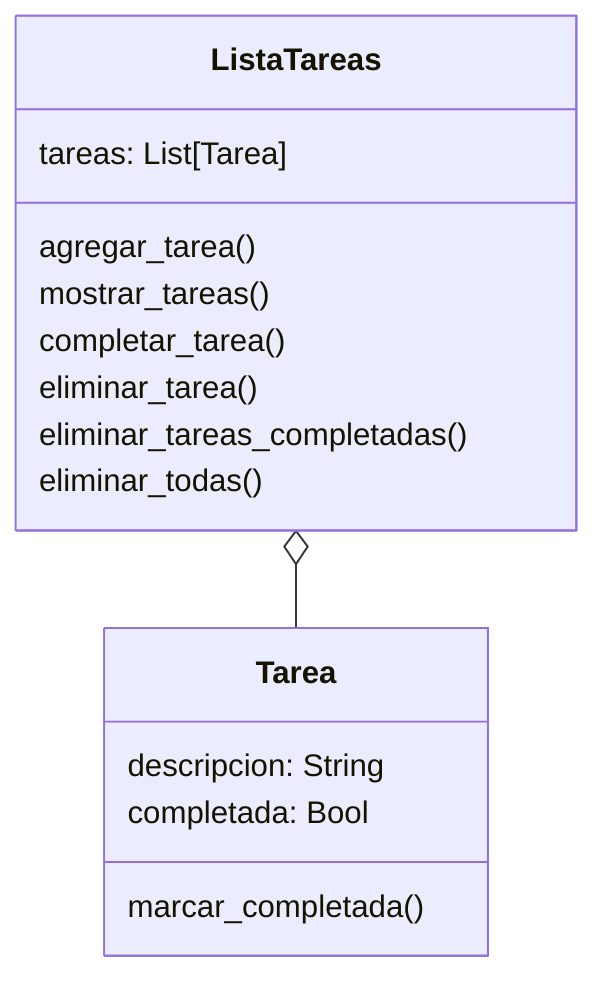

# Análisis
Requisitos:
- Registrar tareas pendientes con una descripción
- Marcar una tarea como completada cuando este terminada
- Eliminar una tarea específica
- Eliminar solo las tareas completadas
- Eliminar todas las tareas registradas
- Mostrar la lista de tareas con el estado en el que se encuentran

Objetos:
- Tarea
- ListaTareas

Caracteristicas:
- Tarea
    - descripcion
    - completada
- ListaTareas
    - tareas

Acciones:
- Tarea
    - marcar completada
- ListaTareas
    - agregar tarea
    - mostrar tareas
    - completar tarea
    - eliminar tarea
    - eliminar tareas completadas
    - eliminar todas

# Diseño
Clases:
- Tarea:
    - Nombre: Tarea
    - Atributos:
      - descripcion: String
      - completada: Bool
    - Métodos:
      - marcar_completada()
- ListaTareas:
    - Nombre: ListaTareas
    - Atributos:
      - tareas: List[Tarea]
    - Métodos:
      - agregar_tarea()
      - mostrar_tareas()
      - completar_tarea()
      - eliminar_tarea()
      - eliminar_tareas_completadas()
      - eliminar_todas()

