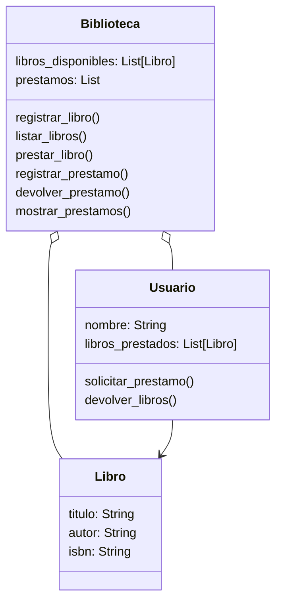

# Análisis
Requisitos:
- Registrar libros con su título, autor e ISBN Información de usuario
- Registrar usuarios mediante su nombre
- Mostrar la lista de libros disponibles
- Permitir que un usuario seleccione uno o varios libros para préstamo
- Asociar libros prestados a un usuario
- Registrar los préstamos activos
- Permitir la devolución conjunta de todos los libros prestados por un usuario
- Mostrar los libros prestados junto con el usuario que los tiene
- Finalizar la ejecución cuando el usuario ingresa la palabra 'salir'
  
Objetos:
- Libro
- Usuario
- Biblioteca

Características:
- Libro:
    - titulo
    - autor
    - isnb
- Usuario:
    - nombre
    - libros prestados
- Biblioteca:
    - libros disponibles
    - prestamos

Acciones:
- Libro:
    - (sin acciones)
- Usuario:
    - solicitar prestamo
    - devolver libros
- Biblioteca:
    - registrar libro
    - listar libros
    - prestar libro
    - registrar prestamo
    - devolver prestamo
    - mostrar prestamos

# Diseño
Clases:
- Libro:
    - Nombre: Libro
    - Atributos:
      - titulo: String
      - autor: String
      - isnb: String
    - Métodos:
      - (sin métodos)
- Usuario:
    - Nombre: Usuario
    - Atributos:
      - nombre: String
      - libros_prestados: List[Libro]
    - Métodos:
      - solicitar_prestamo()
      - devolver_libros()
- Biblioteca:
    - Atributos:
      - libros_disponibles: List[Libro]
      - prestamos: List
    - Métodos:
      - registrar_libro()
      - listar_libros()
      - prestar_libro()
      - registrar_prestamo()
      - devolver_prestamo()
      - mostrar_prestamos()

