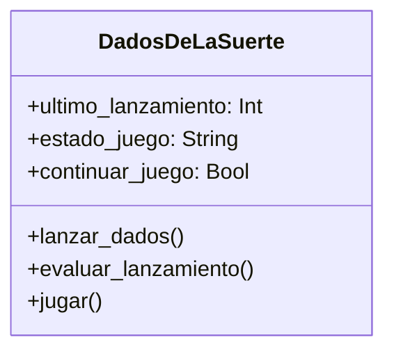

# Análisis
Requisitos:
- Lanzar automáticamente dos dados al iniciar el juego, si la suma es 7 o 11 gana, si es 2, 3 o 12 pierde,
  con cualquier otro valor puede volver a lanzar los dados
- Mostrar el resultado de la tirada y determinar si el jugador gana, pierde o puede volver a lanzar
- Permitir al jugador decidir si quiere volver a lanzar los dados (SI o No) en caso de que la tirada no sea ganadora ni perdedora
- Terminar el juego cuando el jugador decida NO lanzar más o gane o pierda
- Mostrar un mensaje final indicando el resultado del juego
- En futuras versiones, registrar el nombre del jugador y su puntuación más alta, para el lanzamiento inicial no es necesario

Objetos:
- DadosDeLaSuerte

Características:
- DadosDeLaSuerte
    - ultimo lanzamiento
    - estado del juego
    - continuar el juego
    - nombre del jugador
    - puntuacion maxima

Acciones:
- DadosDeLaSuerte
    - lanzar dados
    - evaluar lanzamiento
    - jugar

# Diseño
Clases
- DadosDeLaSuerte:
    - Nombre: DadosDeLaSuerte
    - Atributos:
        - ultimo_lanzamiento: Int
        - estado_juego: String
        - continuar_juego: Bool
    - Métodos:
        - lanzar_dados()
        - evaluar_lanzamiento()
        - jugar()

