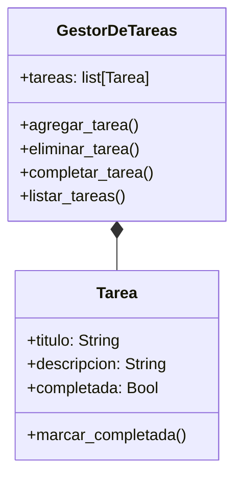

# Análisis
Requisitos:
- Gestionar tareas a traves de un programa
- Asignar a cada tarea un título, descripción y estado
- Agregar nuevas tareas proporcionando un título y una descripción
- Eliminar tareas existentes por su título
- Marcar tareas como completadas por su título
- Listar todas las tareas mostrando su estado actual (completada o no completada)
- En futuras versiones, agregar fechas de vencimiento y prioridades, pero no es necesario implementarlo inicialmente
- Crear la clase Tarea para representar una tarea individual
- Crear la clase GestorDeTareas para gestionar una colección de tareas
- Permitir la gestión de tareas mediante un menú interactivo

Objetos:
- Tarea
- GestorDeTareas

Características:
- Tarea:
    - titulo
    - descripcion
    - completada
- GestorDeTareas:
    - lista de tareas

Acciones:
- Tarea:
    - marcar como completada
- GestorDeTareas
    - agregar tarea
    - eliminar tarea
    - completar tarea
    - listar tareas

# Diseño
Clases
- Tarea:
    - Nombre: Tarea
    - Atributos:
        - titulo: String
        - descripcion: String
        - completada: Bool
    - Métodos:
        - marcar_completada()
- GestorDeTareas:
    - Nombre: GestorDeTareas
    - Atributos:
        - tareas: List[Tarea]
    - Métodos:
        - agregar_tarea()
        - eliminar_tarea()
        - completar_tarea()
        - listar_tareas()

