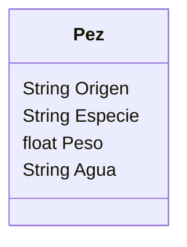

Un acuario quiere llevar un registro de los peces que tiene.
Necesitan registrar la especie, peso y origen.
Los peces pueden ser de agua dulce o salada.
Todos los peces son criados en cautiverio.
Antes de liberarlos se actualiza su peso y luego son liberados.

Requisitos:
- Registrar peces
- Registrar los atributos de cada pez (especie, peso, origen y tipo de agua)
- Actualizar el peso antes de liberarlos
- Liberar a los peces

Objetos:
- Pez

Características:
- Pez
    - Origen
    - Especie
    - Peso
    - Agua

Acciones:
- (No hay acciones)

