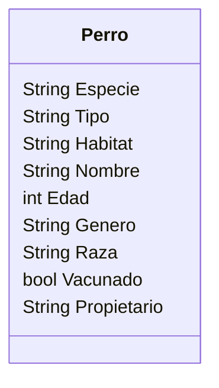

En un clinica veterinaria quieres registrar a los perros 
que llegan a consulta.
De cada perro se necesita registrar su nombre, edad, 
género, raza y si está vacunado ademas del nombre 
del propietario.

Requisitos:
- Registrar perros
- Registrar los atributos de cada perro

Objetos:
- Perro

Características:
- Perro
    - Especie
    - Tipo
    - Habitat
    - Nombre
    - Edad
    - Género
    - Raza
    - Vacunado
    - Propietario

Acciones:
- (No hay acciones)

