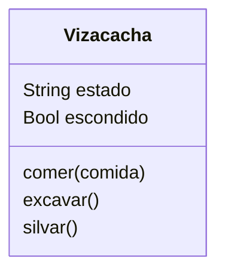

Creas un juego de rol donde eres una vizcacha
Puedes comer sólo zanahorias
Puedes excavar agujeros para esconderte cuando te asustas
Silvar `iiih iiih` te hace feliz

# Análisis

Requisitos:
- Crear una vizcacha
- Come sólo zanahorias
- Excava agujeros cuando se asusta
- Excava agujeros para esconderse
- Silvar `iiih iiih` le hace feliz
  
Objeto:
- Vizcacha

Características:
- Vizcacha: hambre, estado, escondido

Acciones:
- Vizcacha: Comer, excavar, silvar

